#  Go Go Go!!!

## 1 安装与环境

下载： https://studygolang.com/dl


打印空串使用 ： %q

##  2 变量

### 2.1 demo

```go
package main

import "fmt"

var (
	aa = 2
	bb = 3
	cc = 4
)

func varibleZeroValue() {
	var a int
	var s string
	fmt.Printf("%d %q", a, s)
}

func varibleInitialValue() {
	var a, b int = 3, 4
	var str string = "go go go "
	fmt.Println(a, b, str)
}
func varibleTypeDeduction() {
	var a, b = 5, 8
	var str = "tongtong"
	fmt.Println(a, b, str)

	var intV, doubleV, longV, stringV, booleanV = 1, 1.2, 12, "stringing", true
	fmt.Println(intV, doubleV, longV, stringV, booleanV)
}

func variableShorter() {
	intV, doubleV, longV, stringV, booleanV := 1, 1.2, 12, "stringing", true
	fmt.Println(intV, doubleV, longV, stringV, booleanV)
}
func main() {
	fmt.Println("hello go")
	//varibleZeroValue()
	//varibleInitialValue()
	//varibleTypeDeduction()
	variableShorter()
	fmt.Println(aa)
}
```


### 2.2 变量类型

* bool  string
* (u)int    (u)int8    (u)int16   (u)int32   (u)int64    uintptr(指针)
* byte    rune(相当于 char ,应对国际化，32位)
* float32   float64    complex64    complex128(复数)

> 联系复数

```go
/**
复数测试-欧拉公式
 */
func euler() {
/*	c:=3+4i
	d:=5+6i
	fmt.Println(c*d)
	fmt.Println(cmplx.Abs(c))*/
	a:=cmplx.Pow(math.E,1i*math.Pi)+1
	fmt.Println(a)
	b:=cmplx.Exp(1i*math.Pi)+1
	fmt.Println(b)
}
```

> 只有显示的强制类型转换

```go
/**
测试类型转换
 */
func triangle()  {
	var a=3;
	var b=4;
	var c int=int(math.Sqrt(float64(a*a+b*b)))
	fmt.Println(c)
}
```

### 2.3 常量

> 定义常量时不规定类型可以作为各种数值使用,定义后再接收值

```go
const name  = "bytedance" 
func consts() {
	const a, b = 3, 4
	const c = "tongtong"
	fmt.Print(a, b, c)
}
```

### 2.4 枚举

```go
/**
枚举 + 自增值的种子iota
 */
func enums() {
	const (
		java = iota
		_     //跳过自增的数值
		python
		js
		html
		golang
	)
	fmt.Println(java, python, js, html, golang)
	/**
	自增种子
	 */
	const (
		b = 1 << (10 * iota)
		kb
		mb
		gb
		tb
		pb
	)
	fmt.Println(kb, mb, gb, tb, pb)
}

result:
0 2 3 4 5
1024 1048576 1073741824 1099511627776 1125899906842624
```

## 3 条件语句

### 3.1 IF  

 *   if的条件里可以直接赋值
 *   if的条件里赋值的变量作用域就是在这个if语句里

> if 的使用

```go
/**
if的使用
 */
func main() {
	const name = "abc.txt"
	contents, err := ioutil.ReadFile(name)
	if err != nil {
		fmt.Println(err)
	} else {
		fmt.Printf("%s\n", contents)
	}

	if contents1, err1 := ioutil.ReadFile(name); err != nil {
		fmt.Println(err1)
	} else {
		fmt.Printf("%s\n", contents1)
	}
}
```

### 3.2 SWITCH

* 自动break
* switch 后可以省表达式

```go
func eval(a, b int, op string) int {
	var result int
	switch op {
	case "+":
		result = a + b
	case "-":
		result = a - b
	case "*":
		result = a * b
	case "/":
		result = a / b
	default:
		panic("xxxxx" + op)
	}
	return result;
}

func grade(score int) string {
	result := ""
	switch {
	case score < 0 || score > 100:
		panic(fmt.Sprintf("Wrong score : %d", score))
	case score < 60:
		result = "F"
	case score < 80:
		result = "C"
	case score < 90:
		result = "B"
	case score <=100:
		result = "A"
	}
	return result
}
```

### 3.3 FOR

* 无括号

```go
/**
for 循环测试 10进制 转  2进制   省略起始条件
 */
func convertToBin(n int) string {
	result := ""
	for ; n > 0; n /= 2 {
		lsb := n % 2
		result = strconv.Itoa(lsb) + result
	}
	return result
}

/**
读文件测试   -   每次读一行     省略终止条件
 */
func printFile(filename string) {
	file, err := os.Open(filename)
	if err != nil {
		panic(err)
	} else {
		scanner := bufio.NewScanner(file)
		for scanner.Scan() {
			fmt.Println(scanner.Text())
		}
	}
}

/**
省略终止条件  -  相当于while
 */
func forever() {
	for {
		fmt.Println("abc")
	}
}
```

## 4 函数

* 多返回值
* 函数式参数
* 可变参数

```go
package main

import (
	"fmt"
	"math"
	"reflect"
	"runtime"
)

func main() {
	/*	i, i2 := div(4, 3)
		fmt.Println(i,i2)
		q, r := div(103, 10)
		fmt.Println(q,r)
		q2, _ := div(12, 3)
		fmt.Println(q2)*/

	i := apply(pow, 2, 3)
	fmt.Println(i)
    /**
    匿名函数
    */
	i2 := apply(func(a, b int) int {
		return a * b
	}, 100, 200)
	fmt.Println(i2)

	i3 := sum(1, 2, 3, 4, 5, 5)
	fmt.Println(i3)
}

/**
多返回值测试
 */
func div(a, b int) (q, r int) {
	q = a / b
	r = a % b
	return
}

/**
函数式编程  -    函数参数
 */
func pow(a, b int) int {
	return int(math.Pow(float64(a), float64(b)))
}

func apply(op func(a, b int) int, a, b int) int {
	pointer := reflect.ValueOf(op).Pointer()
	name := runtime.FuncForPC(pointer).Name()
	fmt.Println(name)
	return op(a, b);
}

/**
可变参数测试
 */
func sum(numbers ...int) int {
	sum := 0;
	for i := range numbers {
		sum += i
	}
	return sum
}
```

## 5指针

1. 值传递（将参数复制一份）

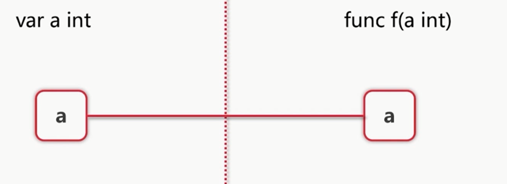

2. 引用传递（通过操作指针来实现）

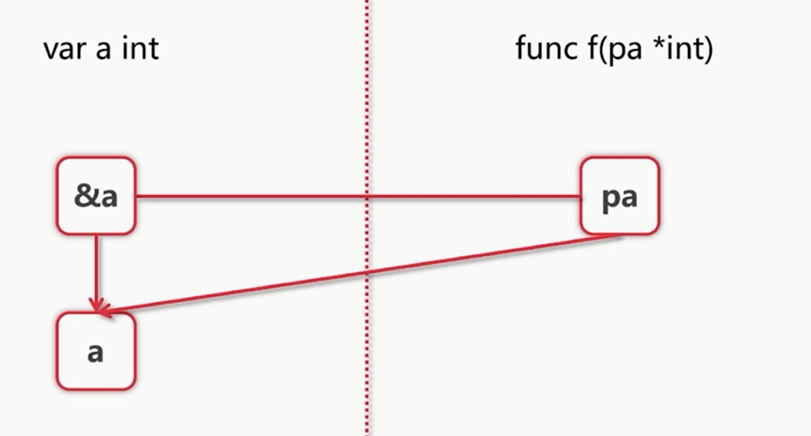

3. 对象的传递

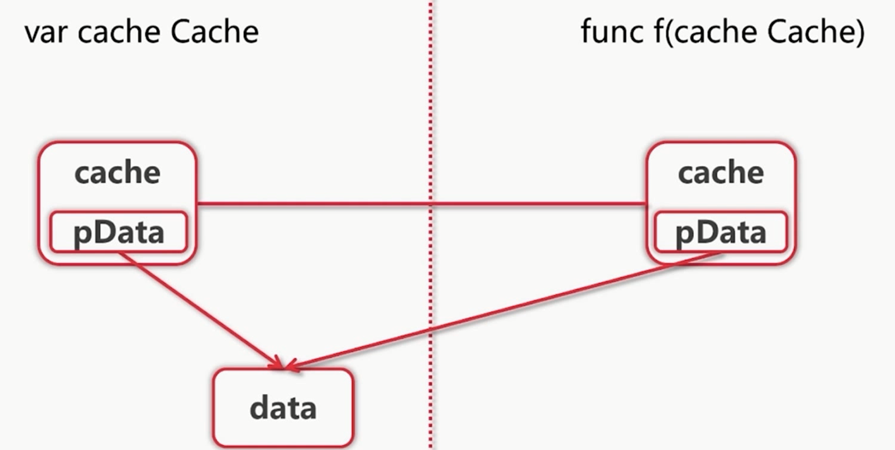

* & 取地址
* 指针


```go
package main

import "fmt"

func main() {
	a := 2;
	var pa *int = &a;
	fmt.Println(pa)
	*pa = 3
	fmt.Println(a)

	b, c := 3, 4
	swap(&b, &c)
	fmt.Println(b, c)
}

func swap(a, b *int) {
	*a, *b = *b, *a
}
```
## 6 数组，切片，容器

### 6.1 数组

* **[10]int 和 [20]int 是不同类型**
* **调用func f(arr [10]int )会拷贝数组**
* **go语言中一般不直接使用数组**
* 添加元素时如果超越cap,系统会重新分配更大的底层数组

```go
package main

import (
	"fmt"
)

func main() {
	//数组的声明
	var arr [5]int
	arr2 := [4]int{2, 3, 4, 5}
	arr3 := [...]int{8, 8, 4, 8}
	fmt.Println(arr, arr2, arr3)
	fmt.Println(len(arr3))

	var grid [4][5]int
	fmt.Println(grid)
	/**
	range 使用下标和关键字
	 */
	for i, v := range arr2 {
		fmt.Println(i, v)
	}
	/**
	range 只是用关键字
	 */
	for _, v := range arr3 {
		fmt.Println(v)
	}

	/**
	遍历二维数组
	 */
	for i := range grid {
		for j := range grid[i] {
			fmt.Printf("%d ", grid[i][j])
		}
		fmt.Println()
	}
}
```

### 6.2 切片(Slice) : slice本身没有数据 ,It is a  view  for array；可以向后扩展，但是不可以向前扩展

> slice 的扩展

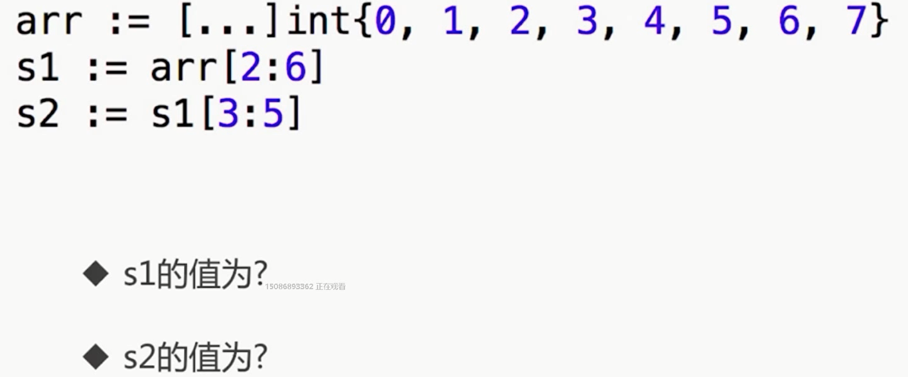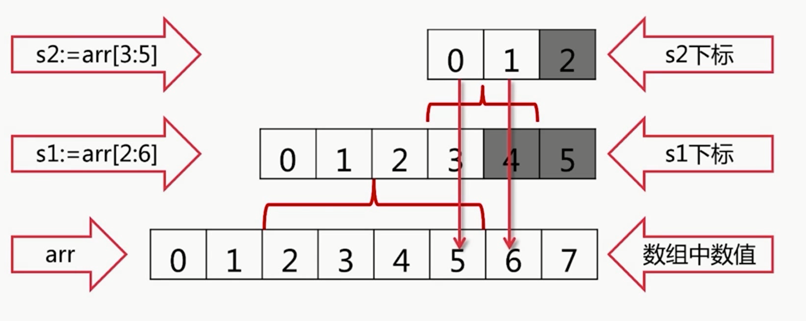

> Slice的实现  s[i]不可以超越len(s),向后扩展不可以超越d底层数组cap(s)
>
> * ptr
> * len 
> * cap

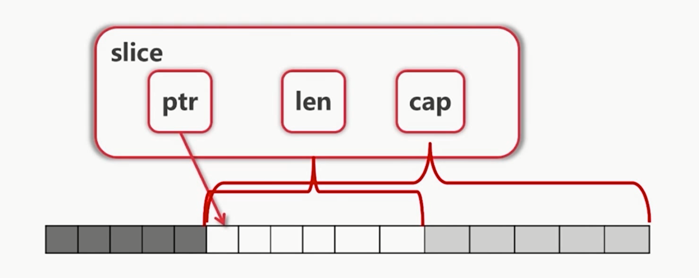

> 案例

```go
package main

import "fmt"

func main() {
	arr := [...]int{0, 1, 2, 3, 4, 5, 6}

	fmt.Println(arr[2:4])
	fmt.Println(arr[2:])
	fmt.Println(arr[:4])
	fmt.Println(arr[:])
	Print(arr[:])
	fmt.Println()
	fmt.Println(arr)
	s := arr[:]
	/**
	reslice
	 */
	fmt.Println("Reslice")
	fmt.Println(s)
	s = s[:3]
	fmt.Println(s)
	s = s[1:]
	fmt.Println(s)
	/**
	Extending slice
	 */
	fmt.Println("Extending slice ........")
	arr[0] = 0
	s1 := arr[2:6]
	fmt.Println(s1)
	s2 := s1[3:5]
	fmt.Println(s2)
	fmt.Printf("s1 is :%v,len is :%d,cap is :%d", s1, len(s1), cap(s1))
    /**
    添加元素
    */
    s3 := append(s1, 10)
	s4 := append(s3, 11)
	fmt.Println("s3   s4   =  ", s3, s4)
	fmt.Println(arr)
}

func Print(arr [] int) {
	arr[0] = 100
	for _, v := range arr {
		fmt.Print(v)
	}
}
```

> slice 的一些操作

```go
package main

import "fmt"

/**
slice操作
 */
func main() {
	var slice []int
	for i := 0; i < 100; i++ {
		slice = append(slice, 2*i+1)
		printSlice(slice)
	}
	fmt.Println(slice)
	/**
	 创建slice的几种方式
	 */
	s1 := []int{2, 4, 6, 8, 10}
	printSlice(s1)
	s2 := make([]int, 16)
	printSlice(s2)
	s3 := make([]int, 10, 100)
	printSlice(s3)
	/**
	复制。。。
	 */
	copy(s2, s1)
	printSlice(s2)
	/**
	删除。。。
	 */
	s2 = append(s2[:3], s2[4:]...)
	printSlice(s2)
	/**
	删除头，尾
	 */
	top := s2[0]
	s2 = s2[1:]
	tail := s2[len(s2)-1]
	s2 = s2[:len(s2)-1]
	fmt.Println(top, tail)
	printSlice(s2)
}

func printSlice(arr []int) {
	fmt.Printf("arr  =   %v,  len  =  %d , cap  =  %d", arr, len(arr), cap(arr))
	fmt.Println()
}
```

### 6.3 Map

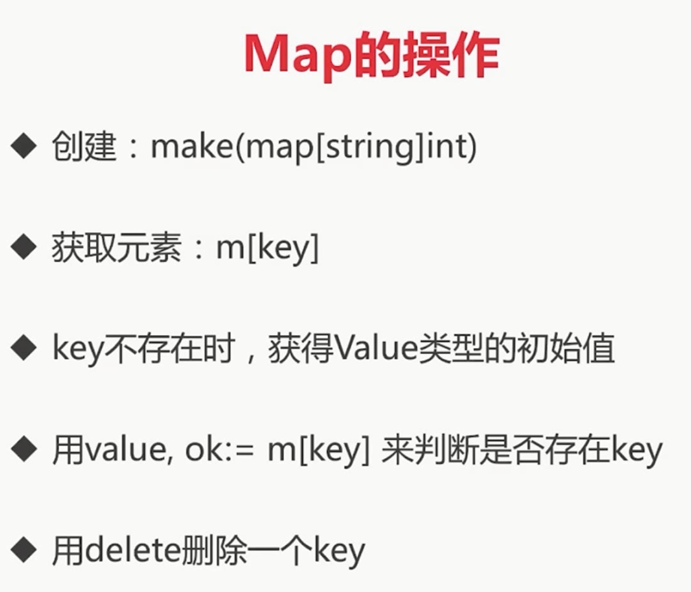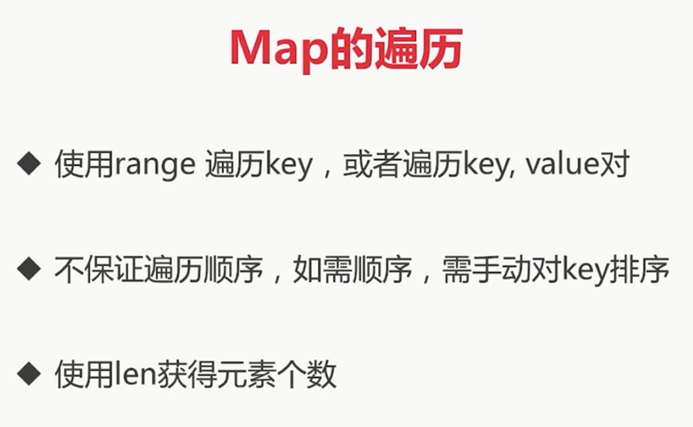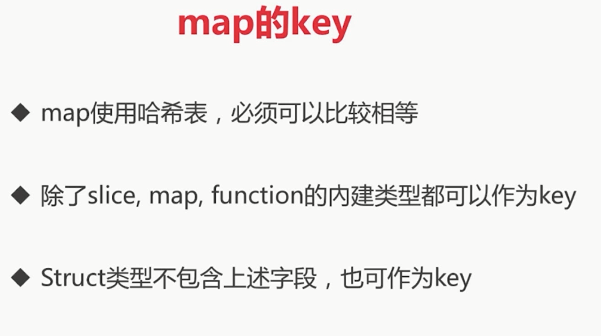

```go
package main

import "fmt"

func main() {
	/**
	Create map 
	 */
	m := map[string]string{
		"name": "tongtong",
		"age":  "191",
		"id":   "8848",
		"sex":  "woman",
	}
	fmt.Println(m)
	m2 := make(map[string]int) //m2 is a empty map
	var m3 map[string]int      //m3 is nil
	fmt.Println(m2, m3)
	/**
	map 的遍历
	 */
	for k, v := range m {
		fmt.Println(k, v)
	}
	/**
	Geting values
	 */
	courseName, ok := m["name"]
	fmt.Println(courseName, ok)

	nilName, ok := m["nil"]
	fmt.Println(nilName, ok)

	/**
	Deleting values
	 */
	delete(m, "name")
	fmt.Println(m)
    fmt.Println(len(m))
}


/**
leetcode 3 给定一个字符串，请你找出其中不含有重复字符的 最长子串 的长度。
 */
func lengthOfLongestSubstring(s string) int {
	m := make(map[byte]int)
	start := 0
	maxLength := 0
	for i, ch := range []byte(s) {
		if lastI, ok := m[ch]; ok && lastI >= start {
			start = m[ch] + 1
		}
		if i-start+1 > maxLength {
			maxLength = i - start + 1
		}
		m[ch] = i
	}
	return maxLength
}
```

### 6.4 字符和字符串的处理

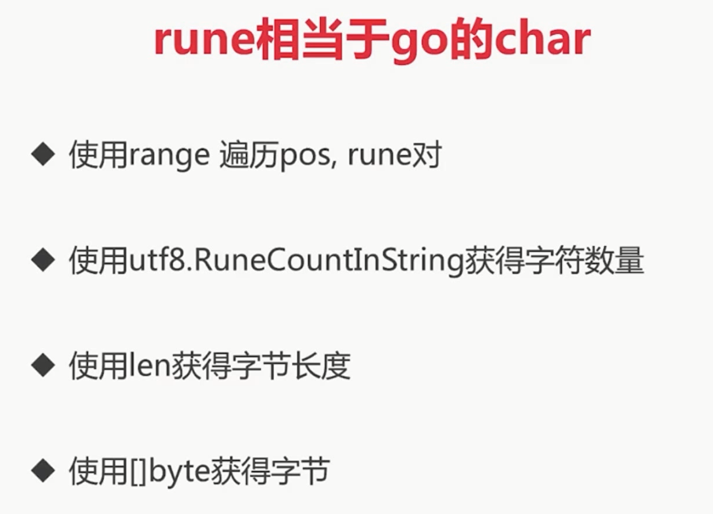

> Demo

```go
package main

import (
	"fmt"
	"unicode/utf8"
)

func main() {
	s := "Yes钢铁侠!"
	fmt.Println(s)
	for _, b := range []byte(s) {
		fmt.Printf("%X ", b)
	}
	fmt.Println()
	for i, ch := range s {
		fmt.Printf("(%d %X) ", i, ch)
	}
	fmt.Println()
	bytes := []byte(s)
	fmt.Println(bytes)
	length := len(bytes)
	fmt.Println(length)
	fmt.Println(utf8.RuneCountInString(s))
	for len(bytes) > 0 {
		ch, size := utf8.DecodeRune(bytes) //解压缩第一个UTF-8编码，返回符文和它的宽度以字节为单位
		bytes = bytes[size:]
		fmt.Printf("%c ", ch)
	}

	for i, ch := range []rune(s) {
		fmt.Printf("(%d %c)", i, ch)
	}
}


result:
Yes钢铁侠!
59 65 73 E9 92 A2 E9 93 81 E4 BE A0 21 
(0 59) (1 65) (2 73) (3 94A2) (6 94C1) (9 4FA0) (12 21) 
[89 101 115 233 146 162 233 147 129 228 190 160 33]
13
7
Y e s 钢 铁 侠 ! (0 Y)(1 e)(2 s)(3 钢)(4 铁)(5 侠)(6 !)
```

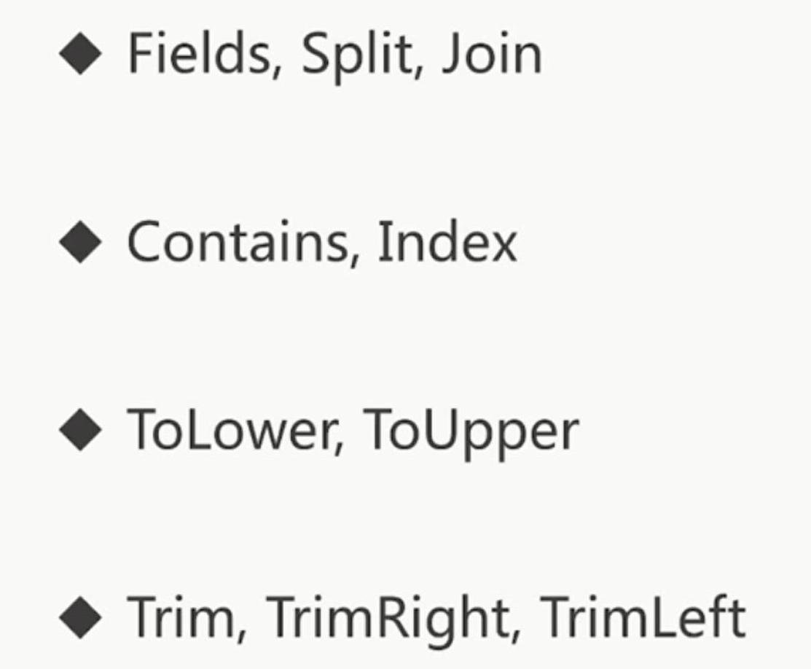